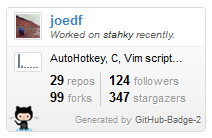
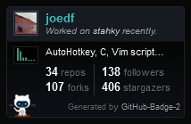

# github-badge-3
 
Cleaned-up implementation, and fork of:  
https://github.com/joedf/github-badge-2

## Setup
- Install `jinja2` and `requests.
- Update `config.json` with your username and github api_key that has user repo read access and user activity.

## Usage
- Update `config.json` with your username and github api_key that has user repo read access and user activity.
- Run `python3 -m ghbadge3 -c config.json`.

Then, set up a cron job or whatever you can use for a recurring / scheduled tasks to run the script periodically (something like every 24hrs) to update the generated `badge.html`. Or you can setup a free jinja webapp like on [pythonanywhere.com](https://pythonanywhere.com/) and simply check if the generated html exists or if modified date of the html file is greater than 1 day, see [example script](https://gist.github.com/joedf/84279ff7647d554a9d15f280a209c6b7).

Remember to set permissions to deny requests all files other than the generated html file.

You can then include the widget with the following code in similar form to:
```html
<iframe src="https://MyWebsite.com/badge.html" style="border:0;height:128px;width:200px;overflow:hidden;" frameBorder="0"></iframe>
```

## Dark theme / Night mode
You can use the dark theme by specifying `class="dark"` on `<body>` in the html template.

## Preview
 
